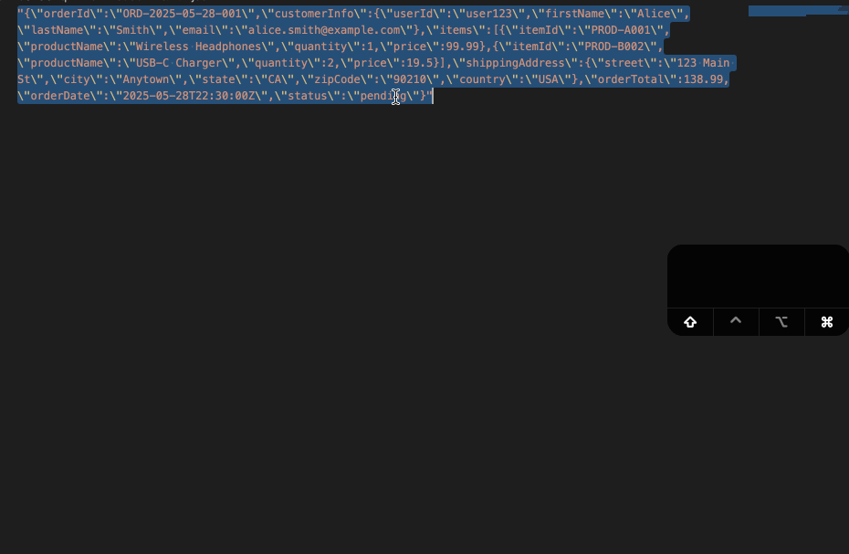
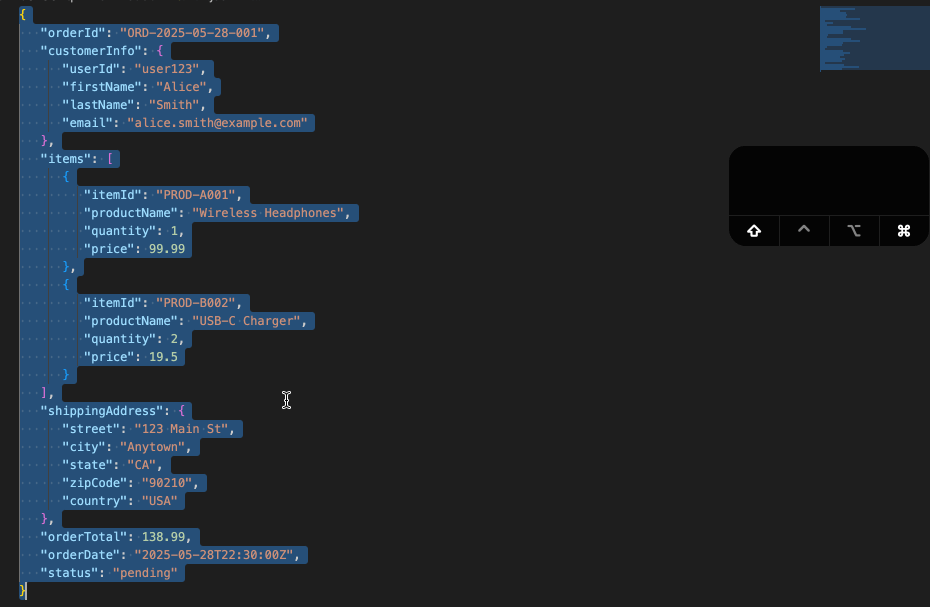

# JSON QuickTools

## 🚀 Overview

**JSON QuickTools** is your essential companion for seamless JSON manipulation. Instantly parse any string into readable JSON or compactify JSON into a string, all with convenient keyboard shortcuts. Streamline your development workflow and save time with this intuitive tool!

---
## ✨ Features

JSON QuickTools is designed to boost your productivity with its core functionalities:

### 🔄 Parse String to JSON

Quickly convert any string content into a formatted, readable JSON structure. This feature is perfect for:
* Transforming raw API responses.
* Debugging malformed JSON strings.
* Making unformatted JSON data digestible at a glance.

Simply select your string, trigger the parse command, and get instant, perfectly indented JSON.

1.  **Select** the string you want to parse in the editor (e.g., `"{\"name\":\"value\"}"`).
2.  Use the keyboard shortcut:
    * **`Cmd+Shift+P`** (macOS)
    * **`Alt+Win+P`** (Windows/Linux)

### ↔️ Stringify JSON

Effortlessly convert a JavaScript object or a formatted JSON string back into a compact, single-line JSON string. This is invaluable when you need to:
* Prepare JSON for sending over a network.
* Minimize file size.
* Generate concise JSON representations.

Select your JSON content or ensure it's in your clipboard, activate the stringify command, and receive a compressed JSON output.

1.  **Select** the JSON text in an active editor/input field
2.  Use the keyboard shortcut:
    * **`Cmd+Shift+O`** (macOS)
    * **`Alt+Win+O`** (Windows/Linux)

### ⌨️ Keyboard Shortcuts

Access all functionalities at lightning speed with dedicated keyboard shortcuts. No more navigating menus – your most common JSON tasks are just a keypress away.

---
## Release Notes

Users appreciate release notes as you update your extension.

### 0.0.1
Initial release

### 0.0.3
Compatibility updated for older versions

### 0.0.5
Keybinding changes for windows

**Enjoy!**
